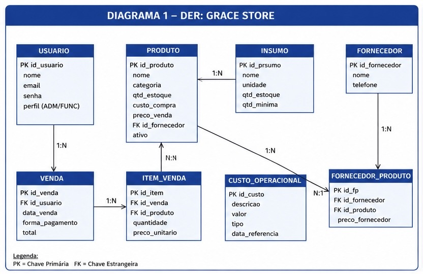
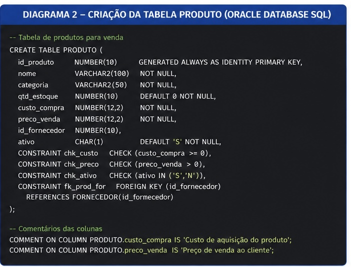
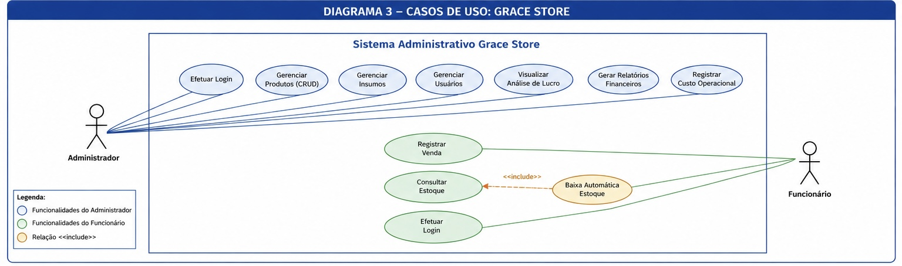

# 👗 Grace Store - Sistema Administrativo de Controle de Estoque, Insumos e Análise de Lucro

<p align="center">
  
  
  
  
  
</p>

## 📌 Sobre o Projeto

O **Grace Store** é um sistema administrativo desenvolvido para auxiliar uma loja de vestuário de pequeno porte no gerenciamento de suas operações diárias. O projeto foi criado com o objetivo de substituir o controle manual utilizado pela empresa, centralizando processos importantes em uma única plataforma.

A solução contempla funcionalidades voltadas para:

✅ Controle de estoque de produtos  
✅ Gestão de insumos operacionais  
✅ Registro de vendas  
✅ Controle de usuários por nível de acesso  
✅ Relatórios financeiros  
✅ Análise de lucro bruto e líquido  

O sistema é voltado para uso interno da loja, permitindo maior organização, confiabilidade das informações e apoio na tomada de decisões.

---

## 🎯 Objetivo do Projeto

Desenvolver um sistema web funcional para a **Grace Store**, capaz de automatizar o gerenciamento de estoque, vendas, insumos e indicadores financeiros, oferecendo suporte administrativo eficiente e reduzindo falhas causadas por processos manuais.

---

## 🚀 Tecnologias Utilizadas

### Front-end
- React
- TypeScript
- HTML5
- CSS3

### Banco de Dados
- Oracle Database
- SQL (DDL / DML)

### Modelagem e Prototipação
- UML (Unified Modeling Language)
- Figma
- Draw.io

### Versionamento
- Git
- GitHub

---

## 🏗️ Arquitetura do Projeto

O sistema foi estruturado com diferentes módulos administrativos, permitindo o gerenciamento completo da operação da loja.

### 👤 Administrador
Possui acesso total ao sistema:

- Gerenciar Produtos (CRUD)
- Gerenciar Insumos
- Gerenciar Usuários
- Registrar Custos Operacionais
- Visualizar Análise de Lucro
- Gerar Relatórios Financeiros
- Consultar Estoque
- Registrar Vendas

### 👨‍💼 Funcionário
Possui acesso restrito:

- Efetuar Login
- Registrar Vendas
- Consultar Estoque

---

# 📊 Modelagem do Banco de Dados

O banco de dados foi modelado utilizando o paradigma relacional, garantindo integridade das informações através de chaves primárias, estrangeiras e regras de validação.

## Diagrama Entidade Relacionamento (DER)




O DER foi elaborado para representar as principais entidades do sistema, incluindo:

- Usuário
- Produto
- Insumo
- Fornecedor
- Venda
- Item de Venda
- Custo Operacional

Além disso, os relacionamentos permitem o controle do estoque e o cálculo de lucro com base nos custos operacionais e preço de venda dos produtos.

---

## Estrutura SQL - Tabela Produto




A tabela **PRODUTO** foi implementada no **Oracle Database** utilizando restrições de integridade, garantindo:

- Validação de preço de venda
- Controle de custo de compra
- Controle de status do produto
- Integridade referencial com fornecedores

---

## 📌 Diagrama de Casos de Uso




O diagrama demonstra as permissões de acesso dos diferentes perfis do sistema:

### Administrador
Acesso completo às funcionalidades administrativas e financeiras.

### Funcionário
Acesso limitado ao registro de vendas e consulta de estoque.

---

## 📄 Artigo Científico

Este projeto também possui um artigo acadêmico contendo toda a fundamentação teórica, modelagem do banco de dados, metodologia e objetivos do sistema.

📥 **Baixe o artigo aqui:**  

[📄 Artigo Grace Store](./docs/Artigo_Grace_Store_CONTEEX_2026_3_b.docx)


---

## 📂 Estrutura do Projeto

```bash
grace-store/
│── src/
│── public/
│── assets/
│   ├── der.jpeg
│   ├── criacao-tabela-produto.jpeg
│   └── casos-de-uso.jpeg
│
│── docs/
│   └── Artigo-Grace-Store.pdf
│
│── README.md
```

---

## ⚙️ Funcionalidades do Sistema

| Funcionalidade | Administrador | Funcionário |
|----------------|---------------|--------------|
| Login | ✅ | ✅ |
| Cadastro de Produtos | ✅ | ❌ |
| Gestão de Insumos | ✅ | ❌ |
| Gestão de Usuários | ✅ | ❌ |
| Registro de Venda | ✅ | ✅ |
| Consulta de Estoque | ✅ | ✅ |
| Relatórios Financeiros | ✅ | ❌ |
| Análise de Lucro | ✅ | ❌ |
| Custos Operacionais | ✅ | ❌ |

---

## 📈 Próximas Implementações

- [ ] Integração do front-end com banco de dados
- [ ] Dashboard financeiro
- [ ] Relatórios automatizados
- [ ] Controle avançado de estoque
- [ ] Sistema de autenticação por perfil
- [ ] Responsividade para dispositivos móveis

---

## 👨‍💻 Equipe do Projeto

- **Ayssa Gabriely Andrade da Silva**
- **Enrico Azevedo de Carvalho**
- **José Rafael Alejandro Casique Reyes**
- **Miguel Miada dos Santos**
- **Pedro Henrique Alencar Gonçalves Monteiro**
- **Rita Gabrieli Rodrigues da Cunha**

**Orientador:**  
**Prof. Me. José Picovsky**

---

## 📚 Referências

- Laudon, K. C.; Laudon, J. P. *Sistemas de Informação Gerenciais*.
- Booch, G.; Rumbaugh, J.; Jacobson, I. *UML: Guia do Usuário*.
- Silberschatz, A.; Korth, H. F.; Sudarshan, S. *Sistema de Banco de Dados*.
- Elmasri, R.; Navathe, S. *Sistemas de Banco de Dados*.

---

<p align="center">
Desenvolvido para o Projeto Integrador — Grace Store 💙
</p>

```sql
-- CRIAÇÃO DAS TABELAS DO BANCO DE DADOS

CREATE TABLE CLIENTE (
    id_cliente NUMBER(5)
        GENERATED BY DEFAULT AS IDENTITY
        PRIMARY KEY,

    nome VARCHAR2(50) NOT NULL,

    email VARCHAR2(100)
        UNIQUE,

    endereco VARCHAR2(100),

    data_registro DATE DEFAULT SYSDATE
);

------------------------------------------------------------

CREATE TABLE TELEFONE (
    id_tel NUMBER(10)
        GENERATED BY DEFAULT AS IDENTITY
        PRIMARY KEY,

    id_cliente NUMBER(5) NOT NULL,

    ddd VARCHAR2(5) NOT NULL,

    numero VARCHAR2(20) NOT NULL,

    tipo VARCHAR2(20),

    CONSTRAINT FK_TELEFONE_CLIENTE
        FOREIGN KEY (id_cliente)
        REFERENCES CLIENTE(id_cliente)
);

------------------------------------------------------------

CREATE TABLE VENDEDOR (
    id_vend NUMBER(10)
        GENERATED BY DEFAULT AS IDENTITY
        PRIMARY KEY,

    nome VARCHAR2(50) NOT NULL,

    data_contrat DATE,

    email VARCHAR2(100)
        UNIQUE,

    fone VARCHAR2(20),

    endereco VARCHAR2(100)
);

------------------------------------------------------------

CREATE TABLE PRODUTO (
    id_produto NUMBER(5)
        GENERATED BY DEFAULT AS IDENTITY
        PRIMARY KEY,

    nome_produto VARCHAR2(50) NOT NULL,

    descricao VARCHAR2(200),

    tamanho VARCHAR2(20),

    categoria VARCHAR2(50),

    cor VARCHAR2(20),

    preco NUMBER(10,2) NOT NULL
        CHECK (preco > 0),

    estoque_disponivel NUMBER(10)
        DEFAULT 0
        CHECK (estoque_disponivel >= 0),

    data_ingresso DATE DEFAULT SYSDATE
);

------------------------------------------------------------

CREATE TABLE PEDIDO (
    id_pedido NUMBER(10)
        GENERATED BY DEFAULT AS IDENTITY
        PRIMARY KEY,

    id_cliente NUMBER(5) NOT NULL,

    id_vend NUMBER(10) NOT NULL,

    data_pedido DATE DEFAULT SYSDATE,

    endereco VARCHAR2(100),

    CONSTRAINT FK_PEDIDO_CLIENTE
        FOREIGN KEY (id_cliente)
        REFERENCES CLIENTE(id_cliente),

    CONSTRAINT FK_PEDIDO_VENDEDOR
        FOREIGN KEY (id_vend)
        REFERENCES VENDEDOR(id_vend)
);

------------------------------------------------------------

CREATE TABLE DETALHE_PEDIDO (
    id_detalhe NUMBER(10)
        GENERATED BY DEFAULT AS IDENTITY
        PRIMARY KEY,

    id_pedido NUMBER(10) NOT NULL,

    id_produto NUMBER(5) NOT NULL,

    quantidade NUMBER(5) NOT NULL
        CHECK (quantidade > 0),

    preco_uni NUMBER(10,2) NOT NULL
        CHECK (preco_uni > 0),

    subtotal NUMBER(10,2)
        GENERATED ALWAYS AS (quantidade * preco_uni) VIRTUAL,

    CONSTRAINT FK_DETALHE_PEDIDO
        FOREIGN KEY (id_pedido)
        REFERENCES PEDIDO(id_pedido),

    CONSTRAINT FK_DETALHE_PRODUTO
        FOREIGN KEY (id_produto)
        REFERENCES PRODUTO(id_produto)
);

------------------------------------------------------------

CREATE TABLE ENTREGADOR (
    id_entregador NUMBER(10)
        GENERATED BY DEFAULT AS IDENTITY
        PRIMARY KEY,

    nome VARCHAR2(50) NOT NULL,

    sobrenome VARCHAR2(50),

    veiculo VARCHAR2(20),

    placa VARCHAR2(20)
        UNIQUE
);

------------------------------------------------------------

CREATE TABLE ENTREGA (
    id_entrega NUMBER(10)
        GENERATED BY DEFAULT AS IDENTITY
        PRIMARY KEY,

    id_pedido NUMBER(10) NOT NULL
        UNIQUE,

    id_entregador NUMBER(10),

    data_entrega DATE,

    end_entrega VARCHAR2(100),

    estado_entrega VARCHAR2(20)
        DEFAULT 'PENDENTE',

    comp_entrega VARCHAR2(100),

    CONSTRAINT FK_ENTREGA_PEDIDO
        FOREIGN KEY (id_pedido)
        REFERENCES PEDIDO(id_pedido),

    CONSTRAINT FK_ENTREGA_ENTREGADOR
        FOREIGN KEY (id_entregador)
        REFERENCES ENTREGADOR(id_entregador),

    CONSTRAINT CHK_ESTADO_ENTREGA
        CHECK (
            estado_entrega IN (
                'PENDENTE',
                'EM_TRANSITO',
                'ENTREGUE',
                'CANCELADO'
            )
        )
);


---


O sistema demonstrou-se eficaz na *automação das rotinas comerciais*, otimizando o controle de produtos, vendas e entregas, além de oferecer suporte à tomada de decisões estratégicas.
